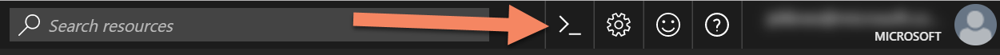
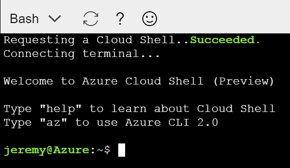
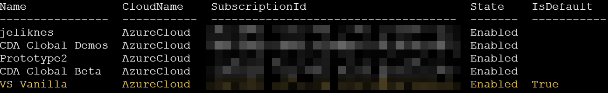
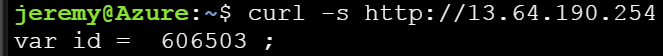

# Day 1

## Getting Started with Azure Cloud Shell

Today we're going to learn about a powerful tool that is built right into your web browser. [Azure Cloud Shell](https://goo.gl/SCRXWy) is a shell you can access from the Azure portal. It attaches to a pre-configured workstation that has several tools and utilities already installed. It automatically authenticates to Azure so you are able to access your resources immediately, and can connect to a storage account to persist files between sessions.

> **The Azure Cloud Shell feature is currently in preview.** However, most of the tools you will use are production-ready and should work fine from the Azure Cloud Shell environment.

The main advantage to using Azure Cloud Shell is the built-in access to the [Azure Command Line Interface (CLI)](https://goo.gl/kU51Da). This tool makes it incredibly easy to create and manage Azure resources. Although you can do most things through the portal UI, most developers find that the CLI is a fast and easy way to accomplish tasks with minimal keystrokes.

## Getting Started

Access the Azure Cloud Shell by clicking on its icon at the top of your portal.

This will open a pane on the web page to host the shell. The first time you access the shell, you will be prompted to connect to a storage account. This storage account not only allows you to save files and information between sessions, but also will enable you to upload files to access from the cloud shell. Follow the prompts to set up storage, then wait for the cloud shell to start:

Now you can begin typing commands. If you start with `az` you will see a list of all of the commands that are possible from the CLI. First, make sure you are working from the right subscription. To see a list of your Azure subscriptions, type:

`az account list --output table`

This will produce a list of subscriptions (you may only have one) and indicate which one is set as the default (highlighted in yellow in this example).

If you need to change the subscription, use the `account set` command. You can pass it the subscription name or the subscription id:

`az account set --subscription=jeliknes`

You can re-list the subscriptions to confirm.

## Resource Groups

[Resource groups](https://goo.gl/PAhuoD) are logical partitions that you can think of as folders for related assets in Azure. Similar resources are typically grouped in the same resource group. You can deploy and destroy all of the assets in a resource group at once. You can also track cost by resource group.

List your resources by issuing the command:

`az group list --o table`

Next, create a new resource group. If you choose a different name, be sure to update it in the next step.

`az group create --name container-group --location westus`

You should see a result that, if successful, contains this:

`"provisioningState": "Succeeded"`

> **Tip: getting help in the Azure CLI**. To get help in the CLI, simply add `--help` to any request. You can iterate through to more complex commands to get help for options. For example, to learn about resource groups you can issue the command `az group --help` to see what commands are available, then `az group list --help` to learn how the `list` command works.

## Run a Container

For the last step we'll do something way more interesting and run a container. Type the following command and hit enter (remember to update the resource group name if you changed it in the previous step).

`az container create --name gosmall --image jlikness/gosmall --ip-address public -g container-group`

This creates a container from the public Docker image I have for a tiny web server that simply outputs the text `var id = <somenumber>;`. After the container is created, you will receive a status message that provides the public IP address that was provisioned:

You can type the ip address in your browser, or use a curl command from the shell, like this:

Be sure to clean up when you're done. You can delete most assets by using the name and the resource group, like this:

`az container delete --name gosmall -g container-group`

Another way is to delete the resource group, which will delete all related assets including the containers.

`az group delete --name container-group`

Make sure you truly want to delete everything inside the resource group before you confirm!

## Conclusion

Today you learned how to access a powerful workstation that is accessible from any browser. Did you know the Azure Cloud Shell is even available from your phone when you install the [Azure mobile app](https://goo.gl/9aYje6)? Use the shell to quickly list, create, and manage resources without having to set up an environment or install any software of your own. What will the shell enable you to do next in the cloud?